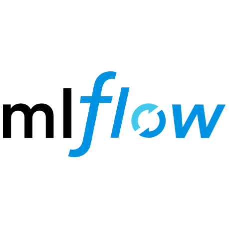

## Hi , I am Hongfan.

Enthusiastic learner!

#### Now
- 🌱 I'm learning MLOps in depth from [DataTalksClub](https://github.com/DataTalksClub/mlops-zoomcamp).
- 💪 I'm taking Data Engineer course from [A CLOUD GURU](https://acloudguru.com/course/google-certified-professional-data-engineer) (It is amazing!!!).
- 🧑‍🎓 Finished Master Graduate in Computer Science (Applied Artificial Intelligence) from uOttawa focused on time-series forecasting concentrated on traffic domain.
-  📝 Sharing my learnings.

#### Bio
- 🙆‍♀️ Open to the job opportunities as ML/AIops, ML engineer, Data engineer, Data Scientist.
- ✨ Thesis work on Graph representation learning, Time-series modeling, Spatio-temporal dependency, Multi-scale modelling, deep-learning-based Model Design.
- 📖 Experience in NLP, Computer Vision, Drug design, Medical image processing.
- 👨🏻‍💻 Past roles include Research assistant, Project Manager(Intern), Teaching assistant.
- 💬 Ping me about **Python**, **Machine Learning**, **MLOps**, **Data Engineer**, **PM**, and of course .
- 📫 Reach me: [Linkedin](https://www.linkedin.com/in/Muhongfan/)

## 🌏 Doing my bit ##

Started **Piggy girls academic help** to provide academic help such as , make grass root level changes with real impact. We opened an Open Fitness Center, an Open Learning Center, an Art Center, and conducted tree plantation programs. With this we had an opporunity impact lives of 50+ people and the journey continues.

## 👨🏻‍💻 Skillset ##

             

## ⚡ Github Stats ##

### Show some ❤️ by starring some of the repositories!

## 📫 Connect With Me

 

